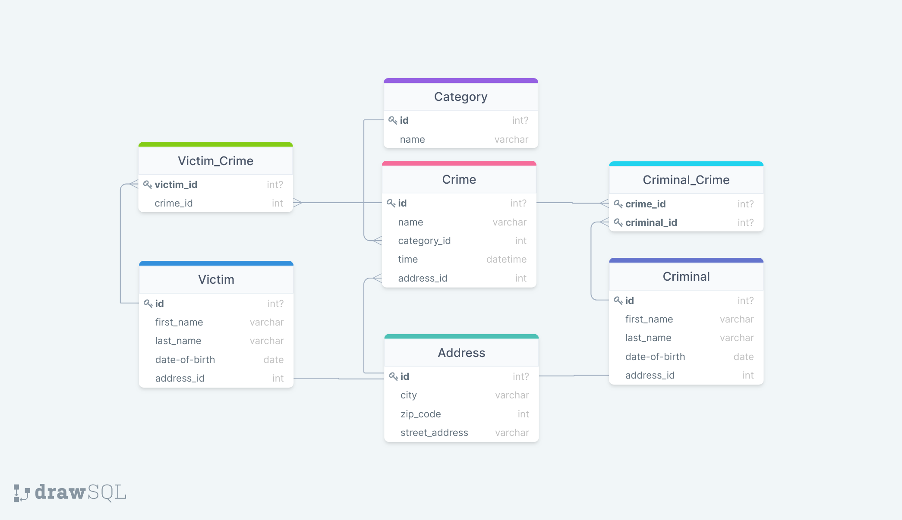

# CrimeDatabase


## Java Enterprise | ITHS | JU21

A Spring Boot application handling crimes, criminals and victims which is stored in a MySQL database. Different roles have
different degree of access throughout the application.

###  E/R diagram


---

### Done [Live features]

* CRUD functionality for all current entities
* Crime, Criminal, User, Victim entities
* Database relations
* Dockerfile + Container

### Planned features

* Spring security milestone
* Release tag deployment milestone
* Custom exceptions
* Thymeleaf frontend
* Implementation of JMS/ActiveMQ
* Various levels of accessibility
* MySQL database
* Token system
* Comprehensive unit testing

---

### Deployment

1. Clone/Fork this repo in your favorite IDE
2. Install Docker Desktop
3. Create and run MySQL docker image/container:
   1. Run command in
      Console: `docker run --name mysql -e MYSQL_ROOT_PASSWORD=my_secret_password -e 'MYSQL_ROOT_HOST=%' -e MYSQL_DATABASE=crime -e MYSQL_USER=user -e MYSQL_PASSWORD=password -p 3309:3306 mysql:latest`
4. Create a .jar file: Go to the folder of the application and run the following from your
   Console: `./mvnw clean package`
5. Build the image: Go to the folder of the application and run the following from your Console:
   `docker image build -t crimedb .`
6. Run the application: `docker container run crimedb`

---

### Endpoints

```
http://localhost:8080
```

