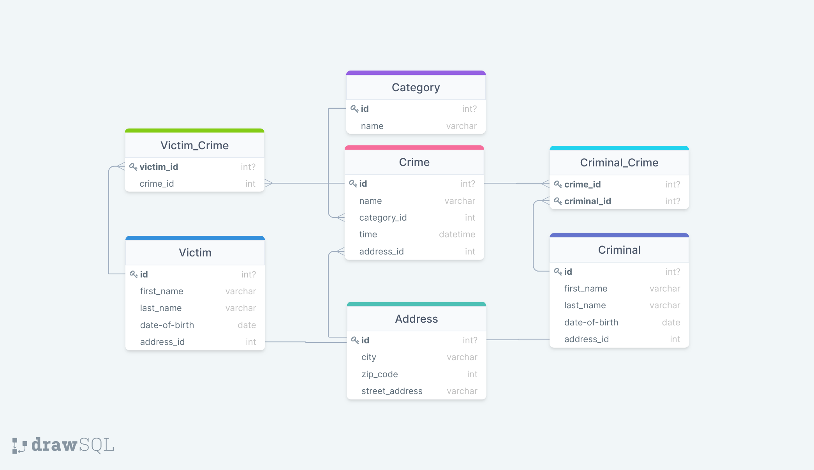

# CrimeDatabase


## Java Enterprise | ITHS | JU21

A Spring Boot application handling crimes, criminals and victims which is stored in a MySQL database. Different roles
have different degree of access throughout the application.

## 1. E/R diagram



---

## 2. Features

### Done [Live features]

* CRUD functionality for all current entities
* Crime, Criminal, User, Victim, Category and Address entities
* Database relations
* Dockerfile + Container
* Custom exceptions
* 
* 
* 

### Planned features

* 
* 
* MySQL database

#### Check out the [ROADMAP](https://github.com/orgs/Patlenlix/projects/1/views/1)

---

## 3. Deployment

### Alternative 1: Download/Clone Repository

- Download the [Latest Release](https://github.com/Patlenlix/CrimeDatabase/releases)
    - Unzip the compressed file where you want to save the application

**OR**

- Clone the repository
    - Go to the folder where you want the application to save
    - Run the following from your Console: `git clone https://github.com/Patlenlix/CrimeDatabase.git`

**RUN APPLICATION: ALTERNATIVE 1**

1. Install [Docker Desktop](https://www.docker.com/products/docker-desktop/) (and run it)
2. Go to the folder of the application
    - Run the following from your Console: `docker-compose up`(If it doesn't work the first time, try to run it again).

### Alternative 2: Download docker image

1. Install [Docker Desktop](https://www.docker.com/products/docker-desktop/) (and run it)
2. Create a `docker-compose.yml` file that looks like this:

```
version: '3.8'

services:
  backend:
    image: ghcr.io/patlenlix/crimedatabase:latest
    ports:
      - "8080:8080"
    environment:
      - SPRING_RABBITMQ_HOST=rabbitmq
    depends_on:
      - rabbitmq

  rabbitmq:
    image: rabbitmq:3-management
    container_name: rabbitmq
    restart: always
    ports:
      - "15672:15672"
      - "5672:5672"
```

**RUN APPLICATION: ALTERNATIVE 2**

1. Go to the folder of the `docker-compose.yml` file
    - Run the following from your Console: `docker-compose up`

### How to Interact with the application (both Alternatives)

1. Use `Insomnia` to run the endpoints below
    - Use `Basic Auth`:
        - **Admin**:
            - Username: admin
            - Password: admin123
        - **User**:
            - Username: user
            - Password: user123
2. To access `RabbitMQ` console to manage messaging service
    - Go to: `http://localhost:15672`
        - Username: guest
        - Password: guest

---

## 4. Endpoints

All URLs for our API start with `http://localhost:8080/api`

#### Category:

| HTTP-verb | URL              | Authorization                        | Info                            |
|-----------|------------------|--------------------------------------|---------------------------------|
| POST      | /categories      | Authenticated users with role ADMIN  | Creates category                |
| DELETE    | /categories/{id} | Authenticated users with role ADMIN  | Deletes category with id = {id} |
| GET       | /categories/{id} | Authenticated users with role ADMIN  | Returns category with id = {id} |
| GET       | /categories      | Authenticated users with role ADMIN  | Returns all categories          |
| PUT       | /categories/{id} | Authenticated users with role ADMIN  | Updates category with id = {id} |

POST and PUT needs a Body with a JSON object. Example of body for POST (PUT also needs id):

```json
{
  "name": "Theft"
}
```

#### Victim:

| HTTP-verb | URL             | Authorization                       | Info                          |
|-----------|-----------------|-------------------------------------|-------------------------------|
| POST      | /victims        | Authenticated users with role ADMIN | Creates victim                |
| DELETE    | /victims/{id}   | Authenticated users with role ADMIN | Deletes victim with id = {id} |
| GET       | /victims/{id}   | Authenticated users with role ADMIN | Returns victim with id = {id} |
| GET       | /victims        | Authenticated users with role ADMIN | Returns all victims           |
| PUT       | /victims/{id}   | Authenticated users with role ADMIN | Updates victim with id = {id} |

POST and PUT needs a Body with a JSON object. Example of body for POST (PUT also needs id):

```json
{
  "firstName": "John",
  "lastName": "Doe",
  "dateOfBirth": "2000-01-01"
}
```

#### Criminal:

| HTTP-verb | URL             | Authorization                       | Info                            |
|-----------|-----------------|-------------------------------------|---------------------------------|
| POST      | /criminals      | Authenticated users with role ADMIN | Creates criminal                |
| DELETE    | /criminals/{id} | Authenticated users with role ADMIN | Deletes criminal with id = {id} |
| GET       | /criminals/{id} | Authenticated users with role ADMIN | Returns criminal with id = {id} |
| GET       | /criminals      | Authenticated users with role ADMIN | Returns all criminals           |
| PUT       | /criminals/{id} | Authenticated users with role ADMIN | Updates criminal with id = {id} |

POST and PUT needs a Body with a JSON object. Example of body for POST (PUT also needs id):

```json
{
  "firstName": "John",
  "lastName": "Doe",
  "dateOfBirth": "2000-01-01"
}
```

#### Address:

| HTTP-verb | URL                | Authorization                       | Info                           |
|-----------|--------------------|-------------------------------------|--------------------------------|
| POST      | /addresses         | Authenticated users with role ADMIN | Creates address                |
| DELETE    | /addresses/{id}    | Authenticated users with role ADMIN | Deletes address with id = {id} |
| GET       | /addresses/{id}    | Authenticated users with role ADMIN | Returns address with id = {id} |
| GET       | /addresses         | Authenticated users with role ADMIN | Returns all addresses          |
| PUT       | /addresses/{id}    | Authenticated users with role ADMIN | Updates address with id = {id} |

POST and PUT needs a Body with a JSON object. Example of body for POST (PUT also needs id):

```json
{
  "city": "Gothenburg",
  "zipCode": "41324",
  "streetAddress": "Street 1"
}
```

#### Crime:

| HTTP-verb | URL              | Authorization                        | Info                           |
|-----------|------------------|--------------------------------------|--------------------------------|
| POST      | /crimes          | Authenticated users with role ADMIN  | Creates crime                  |
| DELETE    | /crimes/{id}     | Authenticated users with role ADMIN  | Deletes crime with id = {id}   |
| GET       | /crimes/{id}     | Authenticated users with role ADMIN  | Returns crime with id = {id}   |
| GET       | /crimes          | Authenticated users with role ADMIN  | Returns all crimes             |
| PUT       | /crimes/{id}     | Authenticated users with role ADMIN  | Updates crime with id = {id}   |

POST and PUT needs a Body with a JSON object. Example of body for POST (PUT also needs id):

```json
{
  "name": "Example crime",
  "time": "2022-03-18 15:48"
}
```

#### Publish RabbitMQ Messaging Service:

| HTTP-verb | URL      | Authorization           | Info                                 |
|-----------|----------|-------------------------|--------------------------------------|
| POST      | /publish | All authenticated users | Sends message internally to Listener |

POST needs a Body with a JSON object. Example of body for POST:

```json
{
  "message": "Sample message"
}
```
